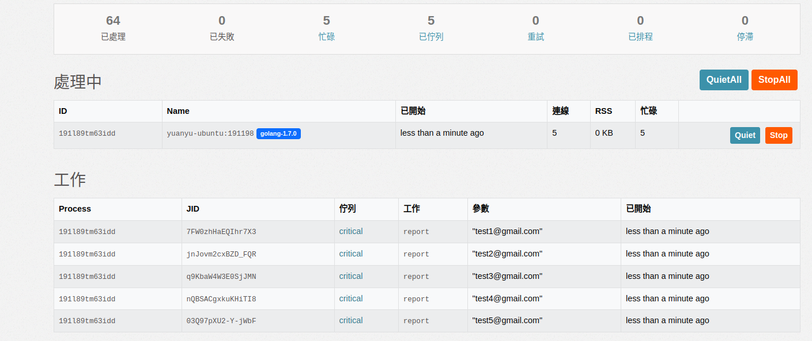

# golang_faktory_worker

This is sample for use golang with faktory to implementation a work

## setup faktory with docker

```yaml
services:
  faktory:
    container_name: faktory
    image: contribsys/faktory:latest
    environment:
      - FAKTORY_PASSWORD=some_password
    volumes:
      - ./data:/var/lib/faktory/db
    ports:
      - 7419:7419
      - 7420:7420
    command: ["/faktory", "-b", ":7419", "-w", ":7420", "-e", "production"]
```
## install dependency

```shell
go get github.com/contribsys/faktory_worker_go
```

## setup with faktory Producer

```golang

func main() {
	client, err := faktory.Open()
	if err != nil {
		panic(err)
	}
	for i := 1; i <= 10; i++ {
		job := faktory.NewJob("report", fmt.Sprintf("test%d@gmail.com", i))
		job.Queue = "critical" // setup queue name
		err = client.Push(job)
		if err != nil {
			fmt.Println("Error pushing job")
		}
	}
}
```

## setup worker

```golang
func main() {
	mgr := worker.NewManager()
	// Job registration
	mgr.Register("email", sendEmail)
	mgr.Register("report", prepareReport)

	// use up to N goroutines to execute jobs
	mgr.Concurrency = 5
	// wait up to 25 seconds to let jobs in progress finish
	mgr.ShutdownTimeout = 25 * time.Second

	// pull job from these queues, in thtis order of precedence
	mgr.ProcessStrictPriorityQueues("critical", "default", "low_priority")
	// alternatively can use weights to avoid starvation
	// mgr.ProcessWeightedPriorityQueues(
	// 	map[string]int{
	// 		"critical":     3,
	// 		"default":      2,
	// 		"top_priority": 1,
	// 	},
	// )
	// Start process
	mgr.Run()
}
func sendEmail(ctx context.Context, args ...interface{}) error {
	help := worker.HelperFor(ctx)
	log.Printf("Working on job with ID: %s\n", help.Jid())
	addr := args[0].(string)
	subject := args[1].(string)

	fmt.Printf("Sending email to %s with subject %s\n", addr, subject)
	time.Sleep(time.Second * 5)
	return nil
}

func prepareReport(ctx context.Context, args ...interface{}) error {
	// helper is use to handle job
  help := worker.HelperFor(ctx)
	log.Printf("Working on job with ID: %s\n", help.Jid())
	addr := args[0].(string)
	fmt.Printf("Preparing report for the user: %s\n", addr)
	time.Sleep(time.Second * 10)
	return help.With(func(cl *faktory.Client) error {
		job := faktory.NewJob("email", addr, "Report is ready")
		return cl.Push(job)
	})
}
```

## test with concurrency dispatcher 10

```shell
make run-producer
make run-worker
```
